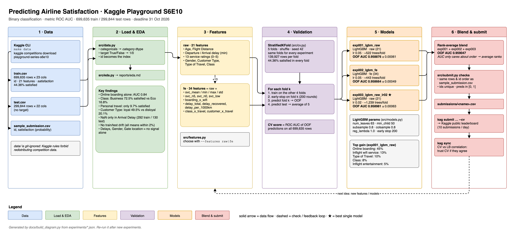

# Predicting Airline Satisfaction · Kaggle Playground S6E10

My solution for [Playground Series – Season 6, Episode 10](https://www.kaggle.com/competitions/playground-series-s6e10):
predict whether an airline passenger was **satisfied**, from their trip details and service ratings.

| | |
|---|---|
| **Task** | Binary classification (`satisfaction`: True / False) |
| **Metric** | ROC AUC on the predicted probability |
| **Data** | 699,635 train rows · 299,844 test rows · 21 features |
| **Timeline** | 1 Oct 2026 → 31 Oct 2026 (23:59 UTC) |
| **Limits** | 10 submissions/day · teams up to 3 |

## Pipeline



Editable source: [docs/pipeline.drawio](docs/pipeline.drawio) (open in [draw.io](https://app.diagrams.net) or the desktop app).
It has two pages: **Pipeline** (above) and **Code map** ([PNG](docs/code-map.png)).
The diagram is generated from `experiments/*.json`, so after new experiments run `python docs/build_diagram.py` to refresh the scores.

## Key findings from EDA

Full report: [reports/eda.md](reports/eda.md) (regenerate with `python src/eda.py`).

- **Target is balanced enough**: 44.4% satisfied. Folds are still stratified.
- **Strongest single signals**: `Online boarding` (AUC 0.84 on its own), `Class` (0.78), `Inflight entertainment` (0.74), `Seat comfort` (0.73), `Type of Travel` (0.70).
- **Segments matter a lot**: Business class is 72.5% satisfied vs 16.8% in Eco; personal travel is only 9.7% satisfied vs 58.4% for business travel.
- **Weak alone**: delays, `Gender`, `Gate location` (AUC ≈ 0.51). They may still help in interactions.
- **Missing values** only in `Arrival Delay in Minutes` (292 train / 130 test); LightGBM handles NaN natively.
- **No train/test drift**: every feature mean differs by under 2%, so local CV should track the leaderboard.

## Notebook

[`notebooks/s6e10_eda_lgbm_baseline.ipynb`](notebooks/s6e10_eda_lgbm_baseline.ipynb) is a self-contained, beginner-friendly walkthrough:
EDA charts → the same stratified 5-fold CV → LightGBM → feature importance → a validated `submission.csv` → what I tried and what's next.
It doesn't import `src/` and finds the data both locally (`../data`) and on Kaggle (`/kaggle/input/...`).

| Mode | Settings | OOF AUC | Kaggle CPU time |
|---|---|---|---|
| default | lr 0.05, early-stopping patience 100 | 0.958829 | 1.7 min (measured) |
| `FULL_EXP003 = True` | exp003: lr 0.02, patience 200 | 0.958981 | 7.6 min (measured) |

## How to run

```bash
make setup     # .venv with Python 3.12 + pandas, scikit-learn, LightGBM
make data      # needs the Kaggle CLI and the competition rules accepted on kaggle.com
make eda       # -> reports/eda.md
make smoke     # 30-second sanity check
make train EXP=exp001_lgbm_raw FEATURES=raw
make submit EXP=exp001_lgbm_raw
```

| Path | What's there |
|---|---|
| `src/config.py` | Paths, column groups, seed, number of folds |
| `src/data.py` | Loads CSVs with typed categoricals and a 0/1 target |
| `src/eda.py` | Writes `reports/eda.md` |
| `src/cv.py` | Stratified 5-fold split, identical for every experiment |
| `src/features.py` | Named feature sets (`--features raw`, …) |
| `src/models.py` | LightGBM hyperparameters |
| `src/train.py` | K-fold training → OOF AUC, `outputs/<exp>/`, `experiments/<exp>.json` |
| `src/submit.py` | Builds `submissions/<exp>.csv`; rank-blends several experiments |
| `experiments/` | One JSON per run: scores, params, feature importance (tracked in git) |

## Results

CV = out-of-fold ROC AUC over the same stratified 5 folds. LB = public leaderboard.

| Exp | Model | Features | CV (OOF AUC) | Fold std | LB | Notes |
|---|---|---|---|---|---|---|
| [exp001](experiments/exp001_lgbm_raw.json) | LightGBM | raw (21) | 0.958876 | 0.00061 | – | Baseline, lr 0.05, ~520 trees/fold, 1.1 min |
| [exp002](experiments/exp002_lgbm_fe.json) | LightGBM | fe (34) | 0.958664 | 0.00049 | – | Rating stats, delays, segment crosses: **worse** by 0.0002 |
| blend 001+002 | rank average | – | 0.958978 | – | – | Diversity helps: +0.0001 over exp001 |
| [exp003](experiments/exp003_lgbm_raw_lr02.json) | LightGBM | raw (21) | 0.958981 | 0.00063 | – | lr 0.02, ~1,240 trees/fold, 2.4 min: best single model |
| blend 003+002 | rank average | – | 0.959000 | – | – | |
| **blend 001+002+003** | rank average | – | **0.959047** | – | **0.95850** | Best so far → `submissions/blend_exp001_exp002_exp003.csv` |

**Leaderboard (5 Oct 2026):** first submission scored **0.95850** on the public LB, rank 423 of 768. CV and LB agree within 0.0006. The top 100 are at 0.96150, a gap of about 0.003 that is 20× larger than any gain from tuning so far, so the next step is a different idea (e.g. adding the original dataset), not more tuning.

Top features by gain (exp001): `Online boarding` 45%, `Inflight wifi service` 13%, `Type of Travel` 10%, `Class` 8%, `Inflight entertainment` 5%.
